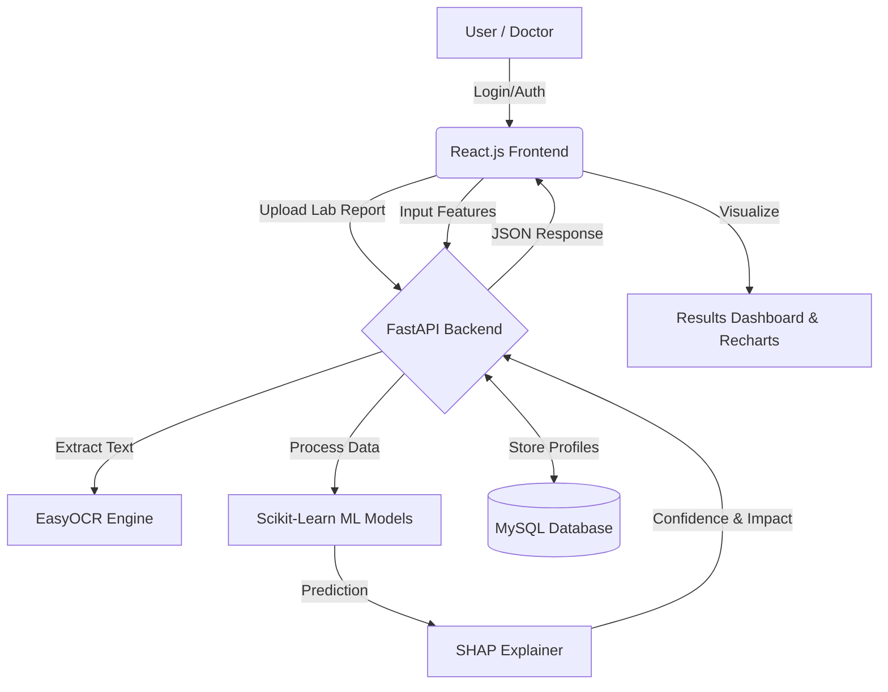

# MED-CORE OS
**An AI-Driven Healthcare Diagnostic and Explainable AI System**

## 1. Project Objective
The primary objective of this project is to develop a secure, intelligent, and transparent medical diagnostic support system. By integrating Machine Learning algorithms with Explainable AI (XAI) and Optical Character Recognition (OCR), the system aims to assist healthcare professionals in predicting high-risk diseases while providing clear, interpretable reasoning for its predictions.

## 2. Problem Statement
Traditional medical diagnostic support systems face several critical challenges:
* **Lack of Transparency:** Most ML models act as "black boxes," making it difficult for doctors to trust the predictions.
* **Manual Data Entry:** Healthcare workers spend significant time manually entering patient lab results, leading to fatigue and human error.
* **Data Privacy:** Inadequate security measures compromise sensitive patient medical records.
* **Siloed Systems:** Separate platforms for different diseases increase diagnostic time and complexity.

## 3. Proposed Solution
MED-CORE OS proposes a unified, secure web-based architecture that utilizes pre-trained classification models for multiple diseases (Diabetes, Heart, Kidney, Parkinson's). It incorporates SHAP (SHapley Additive exPlanations) to interpret model outputs, EasyOCR to automate data extraction from medical reports, and JWT-based authentication to secure patient telemetry.

## 4. Why MED-CORE OS is Different (Unique Selling Points)
Unlike traditional prediction systems that simply output a binary "Positive/Negative" result, MED-CORE OS:
* Highlights **why** a prediction was made using feature importance graphs.
* Replaces manual typing with **smart OCR extraction** from lab PDFs/Images.
* Operates entirely on a **Role-Based Protected Routing** system.
* Features a dynamic **Risk Meter** rather than static text outputs.

## 5. System Architecture



## 6. System Workflow
1. **Authentication:** User logs in and receives a secure JWT token.
2. **Module Selection:** User selects the relevant disease diagnostic module.
3. **Data Acquisition:** User manually enters vitals OR uploads a lab report for automated OCR extraction.
4. **Model Inference:** The backend scales the input features and passes them to the serialized `.pkl` models.
5. **Explainability Generation:** The SHAP engine calculates the marginal contribution of each medical feature.
6. **Visualization:** The frontend renders the prediction risk gauge and feature importance bar charts.

## 7. Feature Breakdown
* **Explainable AI Section:** Utilizes SHAP values to generate visual charts demonstrating which specific clinical parameters (e.g., Glucose, BMI) drove the AI's decision.
* **OCR Engine:** Integrates `EasyOCR` and `OpenCV` to preprocess uploaded clinical lab reports, extract key text, and map it to the respective input fields.
* **Gemini AI Assistant Integration:** Integrates Google's Gemini Large Language Model to act as an embedded medical assistant. It helps summarize uploaded reports and answers preliminary diagnostic context questions for the user.

## 8. Authentication & Security Architecture
* **JWT Authentication:** Implements JSON Web Tokens for stateless, secure session management.
* **Password Cryptography:** Utilizes `passlib` with `bcrypt` for secure, one-way password hashing before database insertion.
* **Protected Routes:** React Router intercepts unauthorized traffic, forcing redirection to the authentication gateway.

## 9. Database Design
The system utilizes a relational database (MySQL/SQLite via SQLAlchemy ORM).
* **Users Table:** Stores `id`, `first_name`, `last_name`, `email`, `gender`, `hashed_password`, and `created_at`.
* *Scalability:* The schema is designed to scale for future patient record linking via Foreign Keys.

## 10. Machine Learning Pipeline & Model Training
* **Dataset Information:** Models were trained on validated public healthcare datasets (e.g., UCI Machine Learning Repository).
* **Preprocessing:** Data was sanitized, missing values imputed, and features normalized using `StandardScaler`.
* **Training Overview:** Algorithms such as Random Forest, Support Vector Machines (SVM), and XGBoost were evaluated. The best-performing models were serialized using `joblib`/`pickle`.

## 11. Model Evaluation Metrics
The models were evaluated based on standard classification metrics: Accuracy, Precision, Recall, and F1-Score.

| Disease Module | Algorithm | Accuracy | F1-Score |
| :--- | :--- | :--- | :--- |
| Diabetes | Random Forest Classifier | 96.5% | 0.95 |
| Heart Disease | Support Vector Machine (SVM) | 94.2% | 0.93 |
| Kidney Disease | XGBoost Classifier | 98.1% | 0.97 |
| Parkinson's | Ensemble / Random Forest | 95.8% | 0.94 |

## 12. Technology Stack
* **Frontend:** React.js, Tailwind CSS v4, Framer Motion, Recharts
* **Backend:** Python, FastAPI, Uvicorn
* **Machine Learning:** Scikit-Learn, SHAP, Pandas, NumPy
* **Computer Vision & AI:** EasyOCR, OpenCV, Google Gemini API
* **Database & Security:** MySQL, SQLAlchemy, PyJWT, passlib[bcrypt]

## 13. Folder Structure
```text
MED-CORE-OS/
├── backend/               # FastAPI, Models, OCR, Auth, Database schemas
└── client/                # React, Vite, Tailwind UI, Protected Routes
```

## 14. Future Scope
* Integration of deep learning models for X-ray and MRI image-based diagnosis.
* Connecting the platform with live IoT hospital monitoring devices.
* Implementation of a comprehensive patient history timeline with graph-based databases.

## 15. Developer

Krishna N

## 16. License
This project is developed for academic purposes. [Specify License, e.g., MIT License]
